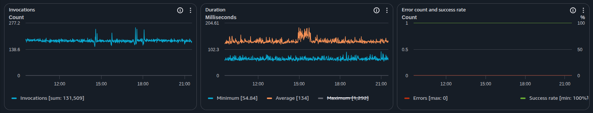

# Rotel Lambda Forwarder

An AWS Lambda function written in Rust that forwards CloudWatch Logs and S3-stored logs to OpenTelemetry-compatible backends. This function receives CloudWatch Logs events via subscription filters or S3 event notifications, transforms them into OpenTelemetry log format, and exports them using the [Rotel](https://github.com/streamfold/rotel) agent. This is built on the existing Rotel OpenTelemetry data plane, so logs can be exported to any [supported exporter](https://rotel.dev/docs/category/exporters).

---

By leveraging the high-performance Rotel data plane, Rotel Lambda Forwarder can transform CloudWatch logs at high-volume while minimizing Lambda runtime duration costs.

_Performance of 12 hours of VPC flow log forwarding to ClickHouse Cloud. Average invocation latency stays under 150ms._

## Features

- **OpenTelemetry Native**: Transforms all logs to OpenTelemetry format
- **Multiple Log Sources**: Supports both CloudWatch Logs subscriptions and S3 event notifications
- **S3 Log Processing**: Automatically processes log files stored in S3 with compression support
- **Multiple Export Targets**: Supports OTLP HTTP/gRPC and other exporters via Rotel
- **Python Log Processors**: Filter, transform, and enrich logs with Python before exporting
- **Automatic parsing**: Support for JSON and key=value parsing, with automatic detection
- **Log stream parser mapping**: Pre-built parser rules for known AWS CW log groups/streams
- **AWS Resource Attributes**: Automatically enriches logs with AWS Lambda and CloudWatch log group tags
- **Reliable delivery**: Ensures logs are delivered successfully before acknowledging request

## Supported services

The following services have been tested to work via CloudWatch Logs and include additional custom handling.
Unlisted services that log via CloudWatch will likely work, but may be missing custom processing. This list will
expand as we verify support for additional services.

| **Source**             | **Location**        |
| ---------------------- | ------------------- |
| CodeBuild Logs         | CloudWatch          |
| CloudWatch Logs        | CloudWatch          |
| CloudTrail Logs        | CloudWatch / S3     |
| EKS Control Plane Logs | CloudWatch          |
| Lambda Logs            | CloudWatch          |
| VPC Flow Logs          | CloudWatch          |
| Application Logs       | S3                  |
| ELB Access Logs        | S3                  |
| Any Log Files          | S3 (JSON, key-value)|

## Deploying

There are two deployment methods available:

1. **Docker Container (Recommended)** - Deploy using container images from Amazon ECR Public
   - Supports all features including Python log processors
   - Automatic image management via CloudFormation
   - Available for both x86_64 and arm64 architectures

2. **ZIP File** - Deploy using pre-built Lambda ZIP packages
   - Simpler deployment for basic use cases
   - Does not support Python log processors
   - Available in release downloads

### Deploy with CloudFormation (Docker Container - Recommended)

The CloudFormation templates automatically pull container images from Amazon ECR Public and copy them to your private ECR repository.

**Note:** Python log processors are only supported when using the Docker container deployment method.

#### Export to OTLP endpoint

Launch this stack to export CloudWatch logs to any OTLP compatible endpoint.

| **x86_64** | **arm64**|
|------------|----------|
| [][otlp-stack-x86-84] | [][otlp-stack-arm64] |

[otlp-stack-x86-84]: https://console.aws.amazon.com/cloudformation/home#/stacks/create/review?stackName=rotel-lambda-forwarder-otlp&templateURL=https://rotel-cloudformation.s3.us-east-1.amazonaws.com/stacks/latest/x86_64/rotel-lambda-forwarder-otlp.yaml
[otlp-stack-arm64]: https://console.aws.amazon.com/cloudformation/home#/stacks/create/review?stackName=rotel-lambda-forwarder-otlp&templateURL=https://rotel-cloudformation.s3.us-east-1.amazonaws.com/stacks/latest/arm64/rotel-lambda-forwarder-otlp.yaml

#### Export to ClickHouse

Launch this stack to export CloudWatch logs to ClickHouse.

| **x86_64** | **arm64**|
|------------|----------|
| [][ch-stack-x86-84] | [][ch-stack-arm64] |

[ch-stack-x86-84]: https://console.aws.amazon.com/cloudformation/home#/stacks/create/review?stackName=rotel-lambda-forwarder-clickhouse&templateURL=https://rotel-cloudformation.s3.us-east-1.amazonaws.com/stacks/latest/x86_64/rotel-lambda-forwarder-clickhouse.yaml
[ch-stack-arm64]: https://console.aws.amazon.com/cloudformation/home#/stacks/create/review?stackName=rotel-lambda-forwarder-clickhouse&templateURL=https://rotel-cloudformation.s3.us-east-1.amazonaws.com/stacks/latest/arm64/rotel-lambda-forwarder-clickhouse.yaml

### Upgrading with CloudFormation

To upgrade the Lambda function to use the latest upstream image, you can update the CloudFormation stack using the **ForceRedeploy** parameter:

#### Method 1: Force Redeploy with Same Tag

If you're using a tag like `latest` and want to pull the newest version:

1. Navigate to your CloudFormation stack in the AWS Console
2. Click **Update** on the stack
3. Select **Use current template**
4. Find the **ForceRedeploy** parameter
5. Increment the value (e.g., change from `1` to `2`, or use a timestamp like `2024-01-15`)
6. Complete the stack update

The CloudFormation stack will automatically:
- Pull the latest image from Amazon ECR Public (`public.ecr.aws/streamfold/rotel-lambda-forwarder`)
- Copy it to your private ECR repository
- Redeploy the Lambda function with the updated image

#### Method 2: Upgrade to Specific Version

To upgrade to a specific version tag (e.g., `v1.2.3`):

1. Navigate to your CloudFormation stack in the AWS Console
2. Click **Update** on the stack
3. Select **Use current template**
4. Find the **ForwarderImageTag** parameter
5. Change the value to the desired version (e.g., from `latest` to `v1.2.3`)
6. Complete the stack update

**Note:** When using CloudFormation deployment, you don't need to manually pull and push images - the stack handles this automatically through a CodeBuild project.

### Manual Deployment to AWS

You can deploy the forwarder manually using either the Docker container (recommended) or ZIP file method.

#### Option 1: Docker Container Deployment (Recommended)

**Supports:** All features including Python log processors

The forwarder is available as a container image in [Amazon ECR Public](https://gallery.ecr.aws/streamfold/rotel-lambda-forwarder):

```
public.ecr.aws/streamfold/rotel-lambda-forwarder:latest
```

##### Step 1: Copy Image to Your Private ECR

First, create a private ECR repository:

```bash
aws ecr create-repository \
  --repository-name rotel-lambda-forwarder \
  --region YOUR_REGION
```

Pull the image from ECR Public and push to your private repository:

```bash
# Login to ECR Public (us-east-1 only)
aws ecr-public get-login-password --region us-east-1 | \
  docker login --username AWS --password-stdin public.ecr.aws

# Pull the image
docker pull public.ecr.aws/streamfold/rotel-lambda-forwarder:latest

# Login to your private ECR
aws ecr get-login-password --region YOUR_REGION | \
  docker login --username AWS --password-stdin YOUR_ACCOUNT_ID.dkr.ecr.YOUR_REGION.amazonaws.com

# Tag the image for your private registry
docker tag public.ecr.aws/streamfold/rotel-lambda-forwarder:latest \
  YOUR_ACCOUNT_ID.dkr.ecr.YOUR_REGION.amazonaws.com/rotel-lambda-forwarder:latest

# Push to your private ECR
docker push YOUR_ACCOUNT_ID.dkr.ecr.YOUR_REGION.amazonaws.com/rotel-lambda-forwarder:latest
```

Replace:
- `YOUR_REGION` with your AWS region (e.g., `us-west-2`)
- `YOUR_ACCOUNT_ID` with your AWS account ID

##### Step 2: Create IAM Execution Role

Create an IAM role with the necessary permissions for the Lambda function:

```bash
aws iam create-role \
  --role-name rotel-lambda-forwarder-role \
  --assume-role-policy-document '{
    "Version": "2012-10-17",
    "Statement": [{
      "Effect": "Allow",
      "Principal": {"Service": "lambda.amazonaws.com"},
      "Action": "sts:AssumeRole"
    }]
  }'
```

Attach the basic Lambda execution policy:

```bash
aws iam attach-role-policy \
  --role-name rotel-lambda-forwarder-role \
  --policy-arn arn:aws:iam::aws:policy/service-role/AWSLambdaBasicExecutionRole
```

Create and attach a custom policy with required permissions:

```bash
aws iam create-policy \
  --policy-name rotel-lambda-forwarder-policy \
  --policy-document '{
    "Version": "2012-10-17",
    "Statement": [
      {
        "Effect": "Allow",
        "Action": [
          "logs:ListTagsForResource"
        ],
        "Resource": "arn:aws:logs:*:*:log-group:*"
      },
      {
        "Effect": "Allow",
        "Action": [
          "ec2:DescribeFlowLogs"
        ],
        "Resource": "*"
      },
      {
        "Effect": "Allow",
        "Action": [
          "s3:GetObject",
          "s3:PutObject"
        ],
        "Resource": "arn:aws:s3:::YOUR_BUCKET_NAME/rotel-lambda-forwarder/*"
      },
      {
        "Effect": "Allow",
        "Action": [
          "s3:ListBucket"
        ],
        "Resource": "arn:aws:s3:::YOUR_BUCKET_NAME"
      },
      {
        "Effect": "Allow",
        "Action": [
          "ecr:GetAuthorizationToken",
          "ecr:BatchCheckLayerAvailability",
          "ecr:GetDownloadUrlForLayer",
          "ecr:BatchGetImage"
        ],
        "Resource": "*"
      }
    ]
  }'

aws iam attach-role-policy \
  --role-name rotel-lambda-forwarder-role \
  --policy-arn arn:aws:iam::YOUR_ACCOUNT_ID:policy/rotel-lambda-forwarder-policy
```

##### Step 3: Create Lambda Function from Container Image

```bash
aws lambda create-function \
  --function-name rotel-lambda-forwarder \
  --package-type Image \
  --code ImageUri=YOUR_ACCOUNT_ID.dkr.ecr.YOUR_REGION.amazonaws.com/rotel-lambda-forwarder:latest \
  --role arn:aws:iam::YOUR_ACCOUNT_ID:role/rotel-lambda-forwarder-role \
  --timeout 30 \
  --memory-size 256 \
  --architectures x86_64 \
  --region YOUR_REGION \
  --environment Variables="{
    ROTEL_EXPORTER=otlp,
    ROTEL_OTLP_EXPORTER_ENDPOINT=https://your-otlp-endpoint.com,
    FORWARDER_S3_BUCKET=your-cache-bucket-name
  }"
```

**Important parameters:**
- `--package-type Image`: Indicates this is a container-based Lambda
- `--code ImageUri`: The full URI of your container image in ECR
- `--architectures`: Must match the image architecture (`x86_64` or `arm64`)
- `--timeout`: Adjust based on your log volume (recommended: 30 seconds)
- `--memory-size`: Adjust based on log volume (recommended: 256-512 MB)

##### Step 4: Update Function with New Image (for updates)

To update the function with a new image version:

```bash
# Pull new image from ECR Public
docker pull public.ecr.aws/streamfold/rotel-lambda-forwarder:v1.2.3

# Tag and push to your private ECR
docker tag public.ecr.aws/streamfold/rotel-lambda-forwarder:v1.2.3 \
  YOUR_ACCOUNT_ID.dkr.ecr.YOUR_REGION.amazonaws.com/rotel-lambda-forwarder:v1.2.3

docker push YOUR_ACCOUNT_ID.dkr.ecr.YOUR_REGION.amazonaws.com/rotel-lambda-forwarder:v1.2.3

# Update Lambda function
aws lambda update-function-code \
  --function-name rotel-lambda-forwarder \
  --image-uri YOUR_ACCOUNT_ID.dkr.ecr.YOUR_REGION.amazonaws.com/rotel-lambda-forwarder:v1.2.3
```

---

#### Option 2: ZIP File Deployment

**Note:** Python log processors are **not supported** with ZIP file deployment. Use Docker container deployment if you need Python processor support.

You can download pre-built Lambda ZIP files for x86_64 and arm64 architectures from the [Releases](https://github.com/streamfold/rotel-lambda-forwarder/releases) page, or from the following links:

| **Region** | **x86_64**                                                                                                                            | **arm64**                                                                                                                            |
| ---------- | ------------------------------------------------------------------------------------------------------------------------------------- | ------------------------------------------------------------------------------------------------------------------------------------ |
| us-east-1  | [Download](https://rotel-lambda-forwarder.s3.us-east-1.amazonaws.com/rotel-lambda-forwarder/latest/x86_64/rotel-lambda-forwarder.zip) | [Download](https://rotel-lambda-forwarder.s3.us-east-1.amazonaws.com/rotel-lambda-forwarder/latest/arm64/rotel-lambda-forwarder.zip) |

The following us-east-1 S3 bucket contains pre-built files for any given release and architecture:

```
s3://rotel-lambda-forwarder/rotel-lambda-forwarder/v{version}/{arch}/rotel-lambda-forwarder.zip
```

for the latest release, use the URL:

```
s3://rotel-lambda-forwarder/rotel-lambda-forwarder/latest/{arch}/rotel-lambda-forwarder.zip
```

---

_NOTE_: These are located in the AWS us-east-1 region, so you can only create Lambda functions in that same region. If
you need to create the function in a different region, you'll need to copy the `rotel-lambda-forwarder.zip` to a different
bucket in the same region as the function.

##### Step 1: Create IAM Execution Role (ZIP Deployment)

Create an IAM role with the necessary permissions for the Lambda function:

```bash
aws iam create-role \
  --role-name rotel-lambda-forwarder-role \
  --assume-role-policy-document '{
    "Version": "2012-10-17",
    "Statement": [{
      "Effect": "Allow",
      "Principal": {"Service": "lambda.amazonaws.com"},
      "Action": "sts:AssumeRole"
    }]
  }'
```

Attach the basic Lambda execution policy:

```bash
aws iam attach-role-policy \
  --role-name rotel-lambda-forwarder-role \
  --policy-arn arn:aws:iam::aws:policy/service-role/AWSLambdaBasicExecutionRole
```

**Additional Required Permissions**

The Lambda function needs permissions to:
1. List tags on CloudWatch Logs log groups
2. Describe VPC flow logs
3. Read and write to the S3 bucket for cache persistence

Create and attach a custom policy:

```bash
aws iam create-policy \
  --policy-name rotel-lambda-forwarder-policy \
  --policy-document '{
    "Version": "2012-10-17",
    "Statement": [
      {
        "Effect": "Allow",
        "Action": [
          "logs:ListTagsForResource"
        ],
        "Resource": "arn:aws:logs:*:*:log-group:*"
      },
      {
        "Effect": "Allow",
        "Action": [
          "ec2:DescribeFlowLogs"
        ],
        "Resource": "*"
      },
      {
        "Effect": "Allow",
        "Action": [
          "s3:GetObject",
          "s3:PutObject"
        ],
        "Resource": "arn:aws:s3:::YOUR_BUCKET_NAME/rotel-lambda-forwarder/*"
      },
      {
        "Effect": "Allow",
        "Action": [
          "s3:ListBucket"
        ],
        "Resource": "arn:aws:s3:::YOUR_BUCKET_NAME"
      }
    ]
  }'

aws iam attach-role-policy \
  --role-name rotel-lambda-forwarder-role \
  --policy-arn arn:aws:iam::YOUR_ACCOUNT_ID:policy/rotel-lambda-forwarder-policy
```

Replace `YOUR_BUCKET_NAME` with your S3 bucket name and `YOUR_ACCOUNT_ID` with your AWS account ID.

Note the role ARN from the output for the next step.

##### Step 2: Create the Lambda Function (ZIP Deployment)

Create the Lambda function using the AWS CLI:

```bash
aws lambda create-function \
  --function-name rotel-lambda-forwarder \
  --runtime provided.al2023 \
  --role arn:aws:iam::YOUR_ACCOUNT_ID:role/rotel-lambda-forwarder-role \
  --handler bootstrap \
  --code S3Bucket=rotel-lambda-forwarder,S3Key=rotel-lambda-forwarder/latest/x86_64/rotel-lambda-forwarder.zip \
  --timeout 30 \
  --memory-size 256 \
  --architectures x86_64 \
  --region REGION \
  --environment Variables="{
    ROTEL_OTLP_EXPORTER_ENDPOINT=https://your-otlp-endpoint.com,
    FORWARDER_S3_BUCKET=your-cache-bucket-name
  }"
```

**Important parameters:**
- `--runtime`: Use `provided.al2023` for Amazon Linux 2023 custom runtime
- `--architectures`: Must match your build target (`x86_64` or `arm64`)
- `--timeout`: Adjust based on your log volume (recommended: 30 seconds)
- `--memory-size`: Adjust based on log volume (recommended: 256-512 MB)

##### Step 3: Update Function Code (for updates)

To update an existing function with the latest version:

```bash
# Update function code
aws lambda update-function-code \
  --function-name rotel-lambda-forwarder \
  --s3-bucket rotel-lambda-forwarder \
  --s3-key rotel-lambda-forwarder/latest/x86_64/rotel-lambda-forwarder.zip
```

##### Step 4: Configure Function Settings (optional)

Update environment variables:

```bash
aws lambda update-function-configuration \
  --function-name rotel-lambda-forwarder \
  --environment Variables="{
    ROTEL_OTLP_EXPORTER_ENDPOINT=https://your-otlp-endpoint.com,
    FORWARDER_S3_BUCKET=your-cache-bucket-name
  }"
```

## Log Group Tag Caching

The Lambda forwarder automatically retrieves and caches tags associated with CloudWatch log groups. Tags are added as resource attributes in the format `cloudwatch.log.tags.<tag-key>`.

**Note:** When deploying via CloudFormation, an S3 bucket for tag caching is automatically created with the name `rotel-lambda-forwarder-<stack-name>-<account-id>`. For manual deployments, you need to create an S3 bucket and set the `FORWARDER_S3_BUCKET` environment variable.

### How It Works

1. **First Request**: When logs are received from a log group for the first time, the forwarder calls the CloudWatch Logs `ListTagsForResource` API to fetch tags.
2. **Caching**: Tags are cached in memory with a 15-minute TTL (from the time they were fetched) to avoid repeated API calls.
3. **S3 Persistence**: If configured with an S3 bucket, the tag cache is persisted to S3 for durability across Lambda cold starts.
4. **Automatic Updates**: The cache is automatically updated when new log groups are encountered or when cached entries expire.

### Configuration

**CloudFormation Deployments:** The S3 bucket is automatically created and configured.

**Manual Deployments:** Set the `FORWARDER_S3_BUCKET` environment variable:

```bash
FORWARDER_S3_BUCKET=your-cache-bucket-name
```

The cache file is stored at: `s3://<bucket>/rotel-lambda-forwarder/cache/log-groups/tags.json.gz`

**Note**: If you don't need tag enrichment, you can omit the `logs:ListTagsForResource` permission from the Lambda's IAM role. A circuit breaker will activate on the first log batch and the forwarder will continue processing logs without tags.

### Example

If a log group has tags `env=production` and `team=platform`, the resource attributes will include:
- `cloudwatch.log.tags.env` = `production`
- `cloudwatch.log.tags.team` = `platform`

## Attribute mapping

### Log record field mapping

The forwarder will attempt to map attributes from a log line to top-level properties of
the OTLP log record when possible. This may vary by log source.

- `trace_id` and `span_id`: if they are present and these match the OTLP format they'll be promoted to the log record fields
- `severity_text` and `severity_number`: attempts to map `level` field to severity fields if possible
- `timestamp`: will be pulled from log fields if possible, or fallback to the observed time when it arrived at the lambda forwarder
- `body`: will look for _log_, _msg_, or _message_ fields. Some log sources may construct an appropriate body text from custom
  attribute fields

If a log record can not be parsed into structured fields, the `body` of the log record will be set to the full string
contents of the log.

### Attribute mapping

The remaining attributes that are not mapped to top-level log record fields are persisted and stored in the
attributes field of the log record. The attribute names are kept identical to their original values
in the incoming CloudWatch log record. The forwarder does not remap these field names by default.

This is for several reasons:

- **Translation loss**: it makes it challenging to translate concepts from AWS documentation if
  field names are not mapped the same, requiring a guide to map between contexts
- **Schema versioning**: changes to the mapping require versioning or migration in order
  to not break existing queries

The forwarder will add an `cloudwatch.id` field to the log record attributes that represents
the unique ID of the log record in CloudWatch. This can be used to dedup unique log records.

## Field stripping

The forwarder supports stripping message fields before they are converted to OTLP log
record attributes. This allows sensitive, verbose, or otherwise uncessary fields to be
removed before shipping them off to an exporter.

This is hard-coded at the moment and is based on the platform the log record is received
from. We plan to make this configurable in the future.

### EKS

* Strips `responseElements.credentials.sessionToken`

## VPC Flow Logs

The forwarder includes comprehensive support for AWS VPC Flow Logs with the following features:

### Automatic Format Detection

- **Dynamic Configuration**: Automatically fetches and caches flow log configurations from the EC2 API
- **Custom Formats**: Supports custom log formats defined in your VPC Flow Log configuration
- **Format Caching**: Caches parsed format configurations with a 30-minute TTL to minimize API calls
- **S3 Persistence**: Flow log configurations are persisted to S3 for durability across Lambda cold starts

### Typed Field Parsing

VPC Flow Log fields are parsed according to their AWS-defined data types per the [docs](https://docs.aws.amazon.com/vpc/latest/userguide/flow-log-records.html).

### Configuration

VPC Flow Logs are automatically detected when the log group name matches the pattern for VPC Flow Logs. No additional configuration is required.

**Note:** The Lambda function requires the following IAM permissions to fetch flow log configurations: `ec2:DescribeFlowLogs`.

These permissions are included in the CloudFormation templates by default.

**Note:** Flow logs should be sent to unique CloudWatch Log Groups. If multiple flow logs are exported to the
same log group then the Lambda Forwarder will be unable to parse the fields correctly.

## Configuration

The Lambda function is configured via the same environment variables supported by Rotel,
as documented in the [docs](https://rotel.dev/docs/category/configuration).

### Secrets support

TODO

### Retrying and reliability

The Lambda Forwarder relies on the at-least-once reliability built into Rotel to
ensure that an incoming request is successfully exported before returning success. This
means that the lambda function duration will include the time to export to all configured
exporters. If an incoming logs request can not be exported during the duration of the function,
the Lambda Forwarder will return a failure. CloudWatch is stated to retry up to 24 hours
for any unsuccesful subscription Lambda request.

Given that failures will be retried by CloudWatch, it makes little sense for Rotel to retry
export requests past the maximum function duration. Therefore, you should set the following
environment variable to prevent requests retrying past the function duration. This should
be set to the function's maximum timeout.

```bash
ROTEL_EXPORTER_RETRY_MAX_ELAPSED_TIME=30s
```

### OTLP Log Processors from S3

You can configure OTLP log processors to transform or filter logs before they are exported. The Lambda Forwarder supports loading processor configurations from any HTTP endpoint or S3 bucket.

See the Python [Processor SDK](https://rotel.dev/docs/category/processor-sdk) for how to construct these processors.

Set the `FORWARDER_OTLP_LOG_PROCESSORS` environment variable of the Lambda Forwarder function, or through
the `LogProcessors` CloudFormation parameter.

```bash
FORWARDER_OTLP_LOG_PROCESSORS="https://gist.githubusercontent.com/mheffner/4d4aaa0f3f7ffc620fb740763f4e0098/raw/parse_vpc_logs.py,s3://my-bucket-name/processors/filter-ecs-logs.py"
```

**Important**: If you load processors from an S3 bucket, make sure the Lambda environment has IAM permissions
to read from the bucket.

**Features**:
- Multiple URIs can be specified as a comma-separated list (supports: http, https, or s3)
- Processors are downloaded to `/tmp/log_processors/`
- Processors are executed in the order specified in `FORWARDER_OTLP_LOG_PROCESSORS`

**Example**: See [examples/processors/parse_vpc_logs.py](examples/processors/parse_vpc_logs.py) for an example of filtering VPC logs that indicate a REJECTED flow.

## Setting Up CloudWatch Logs Subscription

To forward logs from CloudWatch Logs to the Lambda function, create a subscription filter:

### Prerequisites

The Lambda function must have permission to be invoked by CloudWatch Logs for each CloudWatch log
group you want to collect logs from.

Add this permission:

```bash
aws lambda add-permission \
  --function-name rotel-lambda-forwarder \
  --statement-id cloudwatch-logs-invoke \
  --action "lambda:InvokeFunction" \
  --principal logs.amazonaws.com \
  --source-arn "arn:aws:logs:REGION:ACCOUNT_ID:log-group:/YOUR_LOG_GROUP:*"
```

Replace `REGION`, `ACCOUNT_ID`, and `YOUR_LOG_GROUP` with appropriate values.

### Create Subscription Filter

Create a subscription filter to forward logs from a CloudWatch Logs log group:

```bash
aws logs put-subscription-filter \
  --log-group-name YOUR_LOG_GROUP \
  --filter-name forward-to-rotel \
  --filter-pattern "" \
  --destination-arn arn:aws:lambda:REGION:ACCOUNT_ID:function:rotel-lambda-forwarder
```

**Parameters:**

- `--log-group-name`: The CloudWatch Logs log group to forward from
- `--filter-name`: A name for the subscription filter
- `--filter-pattern`: Log filter pattern (use `""` to forward all logs, or specify a pattern)
- `--destination-arn`: ARN of the rotel-lambda-forwarder function

### Important Notes

- Each log group can have a maximum of 2 subscription filters
- The Lambda function must be in the same region as the log group
- Monitor Lambda invocations and errors in CloudWatch Metrics after setup

## Community

Want to chat about this project, share feedback, or suggest improvements? Join our [Discord server](https://discord.gg/reUqNWTSGC)! Whether you're a user of this project or not, we'd love to hear your thoughts and ideas. See you there! 🚀

## Developing

See [DEVELOPING](/DEVELOPING.md) for developer instructions.

## Releasing

See [RELEASING.md](/RELEASING.md) for release process instructions.

---

Built with ❤️ by Streamfold.
